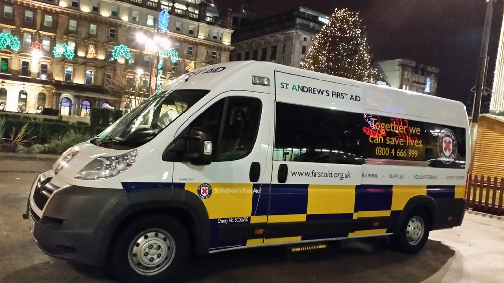
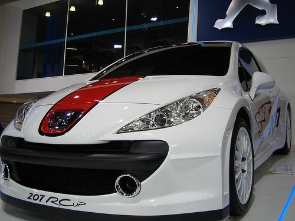
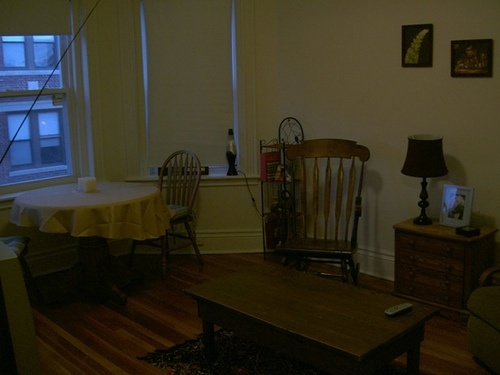
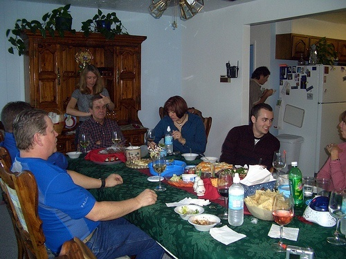
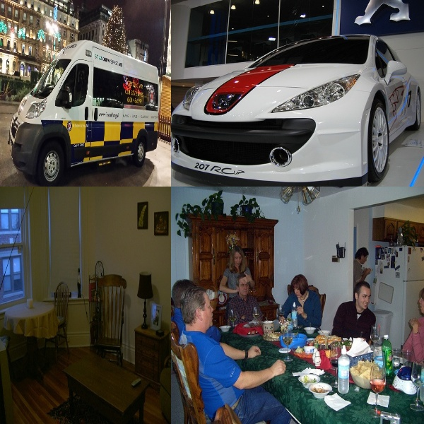
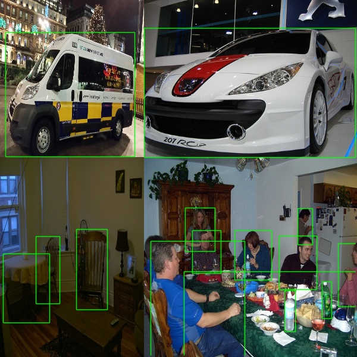

# YOLO Mosaic
> #### Code for mosaic image augmentation implemented from YOLOv4 onwards

Add the required input paths to the `main.py` code and chaange the output paths if required. The code was developed using YOLO style annotation data and expects input annotations in the format ```<class name> <x> <y> <width> <height>```, just like any YOLO architecture. The `classes` variable in the `main.py` can be changed to whatever classes are there in the dataset, the current list is according to the [Pascal VOC](http://host.robots.ox.ac.uk/pascal/VOC/voc2012/#data) dataset.

> #### Example working of the code

Input images:

Image 1                    |  Image 2                  |Image 3                    |  Image 4 
:-------------------------:|:-------------------------:|:-------------------------:|:-------------------------:
    |    |    |  

Output mosaic augmented image with YOLO compatible annotations:

Output Mosaic Image        |  Output with BBoxes
:-------------------------:|:-------------------------:
     |  

> #### Auxiliary function modules
The `dataset.py` function converts the given image and annotation directories into lists of images and their corresponding annotations. After which the `main.py` randomly samples 4 images from the dataset and passes it to the `mosaic.py` function which scales the four images and arranges them to fit in the desired output size and also changes the annotaion values accordingly.

> ##### Heavily inspired from [this code](https://github.com/jason9075/opencv-mosaic-data-aug) which did not support YOLO style annotations 
